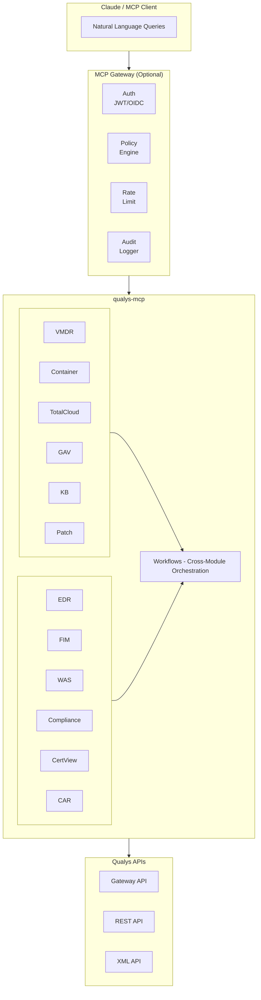

# qualys-mcp

A secure, production-ready Model Context Protocol (MCP) server for Qualys APIs, enabling natural language interaction with your Qualys security data through Claude and other MCP-compatible AI assistants.

**Ask questions like:**
- "Am I affected by CVE-2024-3094?"
- "Show me critical vulnerabilities found this week"
- "List AWS EC2 instances with failing security controls"
- "Any containers running with critical CVEs?"
- "What certificates expire in the next 30 days?"
- "What's the risk summary for this asset and how do I fix it?"

**Get answers that span your entire security stack in seconds.**

## Features

- **70 MCP Tools** across 13 Qualys modules
- **Multi-Cloud Support** - AWS, Azure, GCP, and OCI
- **MCP Gateway** with authentication, authorization, and audit logging
- **JWT/OIDC Authentication** - integrate with Okta, Azure AD, or any OIDC provider
- **Policy-Based Access Control** - role-based tool permissions with wildcard patterns
- **Audit Logging** - JSON audit trail of all tool calls
- **Rate Limiting** - per-user rate limits
- **Input Validation** - protection against injection attacks
- **Prometheus Metrics** - observability endpoint for monitoring

## Available Tools

| Module | Tools | Description |
|--------|-------|-------------|
| VMDR | 8 | Vulnerability scanning, host detections, asset groups, detection stats & summaries |
| Container Security | 6 | Container images, vulnerabilities, runtime security |
| Global AssetView (GAV) | 6 | Asset inventory, tags, search, high-risk assets |
| KnowledgeBase | 4 | Vulnerability research, QID/CVE lookups |
| TotalCloud | 7 | Cloud security posture, AWS/Azure/GCP/OCI, CDR findings |
| Patch Management | 5 | Patch status, deployment jobs, missing patches |
| EDR | 5 | Endpoint detection, events, indicators of compromise |
| FIM | 5 | File integrity monitoring, change events, incidents |
| WAS (TotalAppSec) | 5 | Web application scanning, API security, DAST |
| Compliance | 4 | Policy compliance, scans, exceptions |
| CertView | 5 | SSL/TLS certificates, expiration, endpoints |
| CAR | 6 | Custom assessment and remediation scripts |
| Workflows | 4 | Cross-module risk summaries, remediation plans, external risk prioritization, tech debt analysis |
| **Total** | **70** | |

## Quick Start

### Build

```bash
git clone https://github.com/nelssec/qualys-mcp
cd qualys-mcp
go build -o qualys-mcp ./cmd/qualys-mcp
```

### Configure Claude Desktop

Add to `~/Library/Application Support/Claude/claude_desktop_config.json`:

```json
{
  "mcpServers": {
    "qualys": {
      "command": "/path/to/qualys-mcp",
      "env": {
        "QUALYS_USERNAME": "your-username",
        "QUALYS_PASSWORD": "your-password",
        "QUALYS_POD": "US1"
      }
    }
  }
}
```

### Configure Claude Code

```bash
claude mcp add qualys /path/to/qualys-mcp \
  -e QUALYS_USERNAME=your-username \
  -e QUALYS_PASSWORD=your-password \
  -e QUALYS_POD=US1
```

Then just ask questions naturally:

```
> Am I affected by Log4Shell?
> Show me hosts with critical vulnerabilities
> List failing cloud security controls in AWS
```

### Production Usage (With Gateway)

```bash
go build -o mcp-gateway ./cmd/gateway

./mcp-gateway \
  --mode=http \
  --addr=:8080 \
  --policy=policies.json \
  --audit-log=/var/log/mcp-audit.log \
  --jwt-issuer="https://your-idp.com" \
  --jwks-url="https://your-idp.com/.well-known/jwks.json" \
  --mcp-server=./qualys-mcp
```

## Use Cases

### CVE Triage
```
"Check if we're affected by CVE-2024-3094"
→ Searches KnowledgeBase, VMDR detections, container images, and CDR findings
```

### Cloud Security Posture
```
"Show me failing security controls across all cloud providers"
→ Queries AWS, Azure, GCP, OCI and aggregates results
```

### Threat Hunting
```
"Any suspicious activity in my cloud environments this week?"
→ Pulls CDR findings, EDR events, and FIM incidents
```

### Compliance Reporting
```
"What's our CIS benchmark compliance for AWS?"
→ Retrieves control evaluations and compliance status
```

### Certificate Management
```
"List certificates expiring in the next 30 days"
→ Queries CertView for upcoming expirations
```

### Asset Risk Summary
```
"What's the risk on asset 12345 and how do I fix it?"
→ Combines GAV + VMDR + KB + Patch Management into one view
```

### Remediation Planning
```
"Give me a remediation plan for CVE-2024-1234"
→ Shows affected assets, patches, scripts, and manual remediation steps
```

### External Risk Prioritization
```
"What should I fix first on my internet-facing assets?"
→ Returns prioritized list combining web app vulns, infrastructure vulns, and top risk assets (~2-3k tokens)
```

### Tech Debt Reduction
```
"Help me reduce my tech debt by 30%"
→ Analyzes EOL/EOS software across assets and containers, returns prioritized upgrade plan to hit target
```

## Architecture



## Configuration

### Environment Variables

| Variable | Description | Default |
|----------|-------------|---------|
| `QUALYS_USERNAME` | Qualys API username | - |
| `QUALYS_PASSWORD` | Qualys API password | - |
| `QUALYS_POD` | Qualys platform (US1-4, EU1-3, etc.) | US1 |
| `QUALYS_PLATFORM` | Custom platform hostname (for dev/engineering pods) | - |
| `QUALYS_API_URL` | Custom API base URL (overrides POD) | - |
| `QUALYS_GATEWAY_URL` | Custom Gateway URL (overrides POD) | - |
| `QUALYS_MODULES` | Enabled modules (comma-separated) | all modules |
| `QUALYS_AUDIT_LOG` | Audit log file path | - |
| `QUALYS_RATE_LIMIT` | Requests per minute | 100 |
| `QUALYS_VALIDATE_INPUTS` | Enable input validation | true |

### Custom Platform Support

For engineering, development, or private cloud deployments, use `QUALYS_PLATFORM`:

```bash
export QUALYS_PLATFORM=qualysguard.p03.eng.sjc01.qualys.com
```

This automatically derives:
- API URL: `https://qualysapi.p03.eng.sjc01.qualys.com`
- Gateway URL: `https://gateway.p03.eng.sjc01.qualys.com`

Or specify URLs directly:
```bash
export QUALYS_API_URL=https://qualysapi.custom.qualys.com
export QUALYS_GATEWAY_URL=https://gateway.custom.qualys.com
```

### Supported Qualys PODs

| POD | Region | API URL |
|-----|--------|---------|
| US1 | US Platform 1 | qualysapi.qualys.com |
| US2 | US Platform 2 | qualysapi.qg2.apps.qualys.com |
| US3 | US Platform 3 | qualysapi.qg3.apps.qualys.com |
| US4 | US Platform 4 | qualysapi.qg4.apps.qualys.com |
| EU1 | EU Platform 1 | qualysapi.qualys.eu |
| EU2 | EU Platform 2 | qualysapi.qg2.apps.qualys.eu |
| EU3 | EU Platform 3 | qualysapi.qg3.apps.qualys.eu |
| CA1 | Canada | qualysapi.qg1.apps.qualys.ca |
| IN1 | India | qualysapi.qg1.apps.qualys.in |
| AE1 | UAE | qualysapi.qg1.apps.qualys.ae |
| UK1 | UK | qualysapi.qg1.apps.qualys.co.uk |
| AU1 | Australia | qualysapi.qg1.apps.qualys.com.au |

### Gateway Configuration

| Flag | Environment | Description |
|------|-------------|-------------|
| `--mode` | `MCP_GATEWAY_MODE` | `stdio` or `http` |
| `--addr` | `MCP_GATEWAY_ADDR` | HTTP listen address |
| `--policy` | `MCP_GATEWAY_POLICIES` | Policy JSON file |
| `--audit-log` | `MCP_GATEWAY_AUDIT_LOG` | Audit log path |
| `--jwt-issuer` | `MCP_JWT_ISSUER` | JWT issuer URL |
| `--jwt-audience` | `MCP_JWT_AUDIENCE` | Expected JWT audience |
| `--jwks-url` | `MCP_JWKS_URL` | JWKS endpoint URL |
| `--rate-limit` | `MCP_RATE_LIMIT` | Requests per minute |

## Tool Reference

### VMDR (Vulnerability Management)
| Tool | Description |
|------|-------------|
| `vmdr_list_hosts` | List hosts with vulnerability counts |
| `vmdr_get_host_detections` | Get vulnerabilities for a host |
| `vmdr_search_detections` | Search detections by QID/CVE. Auto-selects output mode based on query specificity |
| `vmdr_get_detection_stats` | Get aggregated detection statistics (counts by severity, top QIDs) |
| `vmdr_get_detection_summary` | Get summarized view with top risk hosts and findings |
| `vmdr_list_scans` | List vulnerability scans |
| `vmdr_get_scan_results` | Get scan results |
| `vmdr_list_asset_groups` | List asset groups |

### Container Security
| Tool | Description |
|------|-------------|
| `cs_list_images` | List container images |
| `cs_get_image_vulnerabilities` | Get image vulnerabilities |
| `cs_list_containers` | List containers |
| `cs_search_images` | Search images with QQL |
| `cs_get_image_details` | Get image details |
| `cs_list_vulnerable_containers` | List running containers with vulnerabilities (by severity, QDS, TruRisk) |

### Global AssetView (GAV/CSAM)
| Tool | Description |
|------|-------------|
| `gav_list_assets` | List all assets |
| `gav_search_assets` | Search assets with QQL |
| `gav_get_asset_details` | Get asset details |
| `gav_list_tags` | List asset tags |
| `gav_get_assets_by_tag` | Get assets by tag |
| `gav_get_high_risk_assets` | Get assets by TruRisk score and criticality |

### KnowledgeBase
| Tool | Description |
|------|-------------|
| `kb_get_qid` | Get QID details |
| `kb_search_vulns` | Search by keyword/CVE |
| `kb_get_cve_mapping` | Map CVE to QIDs |
| `kb_list_recent_vulns` | List recent vulnerabilities |

### TotalCloud (Cloud Security)
| Tool | Description |
|------|-------------|
| `tc_list_connectors` | List AWS/Azure/GCP/OCI connectors |
| `tc_list_resources` | List cloud resources (EC2, VMs, buckets, etc.) |
| `tc_list_controls` | List security controls by provider |
| `tc_list_evaluations` | List control evaluations for an account |
| `tc_get_control_evaluations` | Get control evaluation results |
| `tc_get_resource_evaluations` | Get resource compliance status |
| `tc_list_cdr_findings` | List Cloud Detection & Response findings |

### Patch Management
| Tool | Description |
|------|-------------|
| `pm_list_patches` | List available patches |
| `pm_list_assets` | List assets with patch status |
| `pm_list_jobs` | List patch deployment jobs |
| `pm_get_job_details` | Get job details |
| `pm_get_asset_patches` | Get missing patches for asset |

### EDR (Endpoint Detection & Response)
| Tool | Description |
|------|-------------|
| `edr_list_events` | List EDR events |
| `edr_list_indicators` | List indicators of compromise |
| `edr_list_assets` | List monitored assets |
| `edr_get_asset_events` | Get events for specific asset |
| `edr_search_events` | Search events with query |

### FIM (File Integrity Monitoring)
| Tool | Description |
|------|-------------|
| `fim_list_events` | List file change events |
| `fim_list_profiles` | List monitoring profiles |
| `fim_list_assets` | List monitored assets |
| `fim_list_incidents` | List security incidents |
| `fim_get_asset_events` | Get events for specific asset |

### WAS (Web Application Scanning)
| Tool | Description |
|------|-------------|
| `was_list_webapps` | List web applications |
| `was_list_scans` | List WAS scans |
| `was_list_findings` | List vulnerability findings |
| `was_get_webapp_findings` | Get findings for specific webapp |
| `was_list_reports` | List scan reports |

### Compliance (Policy Compliance)
| Tool | Description |
|------|-------------|
| `pc_list_policies` | List compliance policies |
| `pc_list_scans` | List compliance scans |
| `pc_get_policy_details` | Get policy details |
| `pc_list_exceptions` | List policy exceptions |

### CertView (Certificate Inventory)
| Tool | Description |
|------|-------------|
| `cert_list_certificates` | List SSL/TLS certificates |
| `cert_get_expiring` | Get expiring certificates |
| `cert_list_endpoints` | List SSL endpoints |
| `cert_get_details` | Get certificate details |
| `cert_list_assets` | List assets with certificates |

### CAR (Custom Assessment & Remediation)
| Tool | Description |
|------|-------------|
| `car_list_scripts` | List custom scripts (detection/remediation) |
| `car_get_script` | Get script details |
| `car_execute_script` | Execute script on assets |
| `car_list_jobs` | List script execution jobs |
| `car_get_job_results` | Get job execution results |
| `car_list_remediation_scripts` | List remediation scripts |

### Workflows (Cross-Module Orchestration)
| Tool | Description |
|------|-------------|
| `get_asset_risk_summary` | Comprehensive risk summary for an asset (GAV + VMDR + KB + PM) |
| `get_remediation_plan` | Full remediation plan for a CVE/QID (affected assets, patches, scripts) |
| `prioritize_external_risk` | Token-optimized prioritized remediation list for internet-facing assets (GAV + VMDR + WAS + KB) |
| `get_tech_debt_summary` | Tech debt analysis: EOL/EOS software, affected assets, reduction plan (GAV + Container Security) |

## Security

### Policy Configuration

Create a `policies.json` file (see `policies.yaml.example` for full examples):

```json
{
  "policies": {
    "security-analyst": {
      "name": "security-analyst",
      "description": "Full read access to vulnerability, asset, and threat data",
      "allowed_tools": ["vmdr_*", "kb_*", "gav_*", "cs_*", "edr_*", "fim_*", "was_*"],
      "denied_tools": [],
      "rate_limit_per_min": 100
    },
    "cloud-security": {
      "name": "cloud-security",
      "description": "Cloud security posture and CDR access",
      "allowed_tools": ["tc_*", "gav_list_assets", "gav_search_assets", "kb_*"],
      "denied_tools": [],
      "rate_limit_per_min": 150
    },
    "soc-analyst": {
      "name": "soc-analyst",
      "description": "SOC analyst with EDR, FIM, and CDR for threat hunting",
      "allowed_tools": ["edr_*", "fim_*", "tc_list_cdr_findings", "gav_*", "kb_*"],
      "denied_tools": [],
      "rate_limit_per_min": 200
    },
    "deny-all": {
      "name": "deny-all",
      "denied_tools": ["*"]
    }
  },
  "role_bindings": {
    "security-analyst": ["security-analyst"],
    "cloud-engineer": ["cloud-security"],
    "incident-responder": ["soc-analyst"],
    "anonymous": ["deny-all"]
  },
  "default_policy": "deny-all"
}
```

### JWT/OIDC Integration

The gateway extracts user identity and roles from JWT claims:

```json
{
  "sub": "user123",
  "email": "analyst@company.com",
  "roles": ["security-analyst"],
  "exp": 1234567890
}
```

Supported identity providers:
- Okta
- Azure AD
- Auth0
- Any OIDC-compliant provider

### Audit Logging

Audit logs are written as JSON lines:

```json
{"timestamp":"2025-01-15T10:30:00Z","request_id":"abc123","user_id":"user123","tool":"vmdr_list_hosts","arguments":{"filter":"severity:5"},"success":true,"duration_ms":234}
```

### Input Validation

The gateway validates:
- QQL query syntax and length
- CVE format (CVE-YYYY-NNNNN)
- Image ID format (SHA256)
- Parameter bounds (limit, offset)
- Injection pattern detection (SQL, XSS)

## Observability

### Prometheus Metrics

The gateway exposes metrics at `/metrics`:

```
mcp_gateway_tool_calls_total
mcp_gateway_tool_calls_by_name{tool="vmdr_list_hosts"}
mcp_gateway_auth_successes_total
mcp_gateway_auth_failures_total
mcp_gateway_policy_denials_total
mcp_gateway_rate_limited_total
mcp_gateway_tool_duration_seconds_bucket{le="0.1"}
```

### Health Checks

- `/health` - Gateway health
- `/ready` - Ready to accept requests

## Project Structure

```
qualys-mcp/
├── cmd/
│   ├── qualys-mcp/          # MCP server entry point
│   └── gateway/             # Gateway entry point
├── config/                  # Configuration
├── internal/
│   ├── auth/                # Qualys authentication
│   ├── credentials/         # Credential storage (keychain)
│   ├── domain/              # Domain types and errors
│   ├── gateway/             # Gateway implementation
│   ├── logging/             # Structured logging (slog)
│   ├── middleware/          # Middleware chain
│   ├── modules/             # Qualys API modules
│   │   ├── vmdr/
│   │   ├── container/
│   │   ├── gav/
│   │   ├── knowledgebase/
│   │   ├── totalcloud/
│   │   ├── patch/
│   │   ├── edr/
│   │   ├── fim/
│   │   ├── was/
│   │   ├── compliance/
│   │   ├── certview/
│   │   ├── car/             # Custom Assessment & Remediation
│   │   └── workflows/       # Cross-module orchestration
│   └── server/              # MCP server setup
├── pkg/
│   └── policy/              # Policy engine
└── policies.yaml.example    # Example policy config
```

## Development

### Running Tests

```bash
go test ./... -v
```

### Adding a New Module

1. Create `internal/modules/newmodule/`
2. Implement `client.go` with API methods
3. Implement `tools.go` with MCP tool registrations
4. Register in `internal/server/server.go`
5. Add module name to config validation

## Deployment

### Docker

```dockerfile
FROM golang:1.23 AS builder
WORKDIR /app
COPY . .
RUN go build -o qualys-mcp ./cmd/qualys-mcp
RUN go build -o mcp-gateway ./cmd/gateway

FROM gcr.io/distroless/base
COPY --from=builder /app/qualys-mcp /
COPY --from=builder /app/mcp-gateway /
COPY policies.json /
ENTRYPOINT ["/mcp-gateway"]
```

### Kubernetes

```yaml
apiVersion: apps/v1
kind: Deployment
metadata:
  name: mcp-gateway
spec:
  template:
    spec:
      containers:
      - name: gateway
        image: qualys-mcp:latest
        args:
        - --mode=http
        - --addr=:8080
        - --policy=/config/policies.json
        ports:
        - containerPort: 8080
        livenessProbe:
          httpGet:
            path: /health
            port: 8080
        readinessProbe:
          httpGet:
            path: /ready
            port: 8080
```

## Disclaimer

This is an independent open-source project and is not affiliated with, endorsed by, or supported by Qualys, Inc. Qualys is a registered trademark of Qualys, Inc.

Use of this software requires valid Qualys API credentials and appropriate licensing from Qualys.

## License

MIT License - see [LICENSE](LICENSE) for details.

Copyright (c) 2025 Andrew Nelson <andrew@nelssec.com>
