# Building a Production-Ready MCP Server for Qualys Security APIs

**TL;DR:** We built an MCP (Model Context Protocol) server that enables AI assistants like Claude to interact with Qualys security APIs using natural language. This post covers the architecture, security controls, and hardening process.

## What is MCP?

Model Context Protocol (MCP) is an open standard developed by Anthropic that allows AI assistants to interact with external tools and data sources. Think of it as a standardized way for LLMs to call functions—similar to OpenAI's function calling, but designed as a protocol that any client or server can implement.

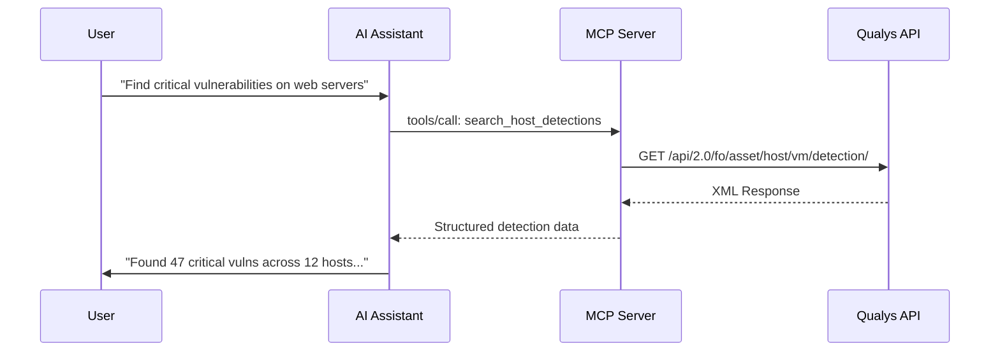

MCP uses JSON-RPC 2.0 over stdio (for local tools) or HTTP with Server-Sent Events (for remote tools). The protocol defines three primitives:

- **Tools**: Functions the AI can invoke (our focus)
- **Resources**: Data the AI can read
- **Prompts**: Reusable prompt templates

## Why Qualys + MCP?

Qualys provides comprehensive security APIs across vulnerability management, container security, web application scanning, and more. However, these APIs require:

1. Knowledge of Qualys Query Language (QQL) syntax
2. Understanding of API endpoints and parameters
3. Manual correlation across multiple data sources

An MCP server abstracts this complexity. Security teams can ask questions like:

- "What are the most critical unpatched vulnerabilities?"
- "Show me containers with HIGH severity CVEs in production"
- "Which hosts haven't been scanned in 30 days?"

The AI handles QQL construction, API calls, and response interpretation.

## Architecture Overview

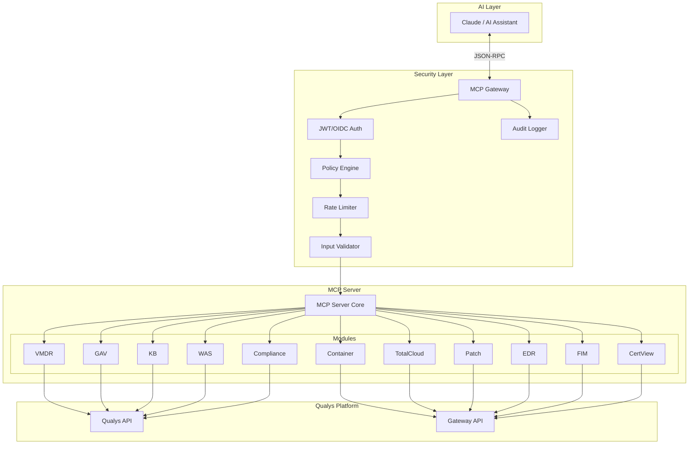

### Component Breakdown

**MCP Server Core** (`cmd/qualys-mcp/main.go`): Handles JSON-RPC protocol, tool registration, and request routing.

**Modules**: Each Qualys product area is a separate module with its own tools:

| Module | Tools | Qualys API |
|--------|-------|------------|
| VMDR | 6 | `/api/2.0/fo/` |
| Container Security | 5 | Gateway API |
| Global AssetView (GAV) | 5 | `/api/2.0/fo/asset/` + Gateway |
| KnowledgeBase | 4 | `/api/2.0/fo/knowledge_base/` |
| TotalCloud | 5 | Gateway API |
| Patch Management | 5 | Gateway API |
| EDR | 5 | Gateway API |
| FIM | 5 | Gateway API |
| WAS (TotalAppSec) | 5 | `/api/3.0/` |
| Policy Compliance | 4 | `/api/2.0/fo/compliance/` |
| CertView | 5 | Gateway API |
| **Total** | **54** | |

**MCP Gateway** (`cmd/gateway/main.go`): Optional security proxy that adds enterprise controls.

## Tool Implementation

Each MCP tool follows a consistent pattern:

```go
type SearchHostDetectionsArgs struct {
    QQL       string `json:"qql"`
    Severities string `json:"severities,omitempty"`
    Limit     int    `json:"limit,omitempty"`
}

func (m *Module) registerSearchHostDetections(s *server.MCPServer) {
    s.AddTool(mcp.NewTool(
        "search_host_detections",
        mcp.WithDescription("Search vulnerability detections using QQL"),
        mcp.WithString("qql", mcp.Description("Qualys Query Language filter")),
        mcp.WithString("severities", mcp.Description("Filter: 1-5 or critical,high,medium,low")),
        mcp.WithNumber("limit", mcp.Description("Max results (default 100)")),
    ), m.handleSearchHostDetections)
}

func (m *Module) handleSearchHostDetections(ctx context.Context, req mcp.CallToolRequest) (*mcp.CallToolResult, error) {
    var args SearchHostDetectionsArgs
    if err := json.Unmarshal(req.Params.Arguments, &args); err != nil {
        return common.NewToolResultError("invalid arguments"), nil
    }

    // Build API request with QQL
    params := url.Values{"action": {"list"}}
    if args.QQL != "" {
        params.Set("qql", args.QQL)
    }

    // Call Qualys API
    resp, err := m.client.Get(ctx, "/api/2.0/fo/asset/host/vm/detection/", params)
    // ... process response
}
```

The AI sees tool descriptions and decides when/how to call them. For example, when a user asks about "critical vulnerabilities on Linux servers," Claude might construct:

```json
{
  "jsonrpc": "2.0",
  "method": "tools/call",
  "params": {
    "name": "search_host_detections",
    "arguments": {
      "qql": "vulnerabilities.severity:5 and os.category:Linux",
      "limit": 50
    }
  }
}
```

## Security Architecture

Running an MCP server in production requires careful security consideration. The AI can invoke any registered tool, so we need defense in depth.

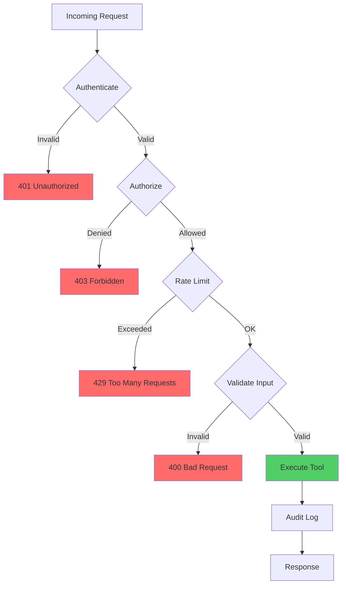

### 1. Authentication

The gateway supports multiple authentication methods:

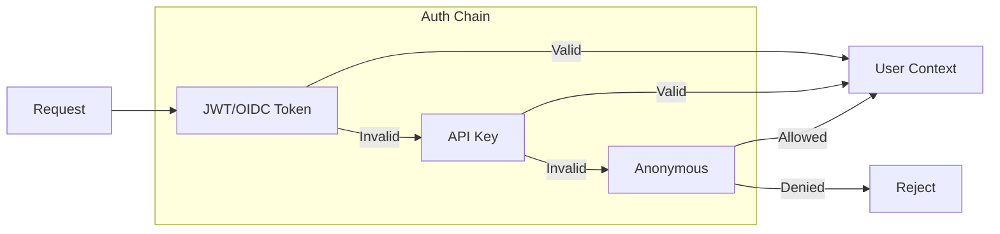

**JWT/OIDC Authentication** (`internal/gateway/auth.go`):

```go
type JWTAuth struct {
    config    JWTAuthConfig
    jwksCache map[string]*rsa.PublicKey
    cacheMu   sync.RWMutex
}

func (j *JWTAuth) Authenticate(ctx context.Context, token string) (*domain.User, error) {
    // Strip "Bearer " prefix
    token = strings.TrimPrefix(token, "Bearer ")

    // Parse without verification first to get key ID
    unverified, _, err := new(jwt.Parser).ParseUnverified(token, jwt.MapClaims{})
    if err != nil {
        return nil, fmt.Errorf("parse token: %w", err)
    }

    kid, _ := unverified.Header["kid"].(string)

    // Fetch public key from JWKS endpoint
    pubKey, err := j.getPublicKey(ctx, kid)
    if err != nil {
        return nil, fmt.Errorf("get public key: %w", err)
    }

    // Verify signature and claims
    verified, err := jwt.Parse(token, func(t *jwt.Token) (interface{}, error) {
        return pubKey, nil
    }, jwt.WithValidMethods([]string{"RS256"}),
       jwt.WithIssuer(j.config.Issuer),
       jwt.WithAudience(j.config.Audience))

    // Extract user from claims
    claims := verified.Claims.(jwt.MapClaims)
    return &domain.User{
        ID:       claims["sub"].(string),
        Username: claims["preferred_username"].(string),
        Roles:    extractRoles(claims),
    }, nil
}
```

### 2. Policy-Based Authorization

The policy engine evaluates requests against configurable rules:

```yaml
# policies.yaml
policies:
  - name: security-analyst
    description: Read-only access to vulnerability data
    tools:
      allow:
        - "search_*"
        - "get_*"
        - "list_*"
      deny:
        - "delete_*"
        - "launch_*"
    arguments:
      qql:
        max_length: 1000
        patterns:
          deny:
            - "(?i)drop|delete|truncate"

  - name: security-admin
    description: Full access to all tools
    tools:
      allow: ["*"]

bindings:
  - role: analyst
    policy: security-analyst
  - role: admin
    policy: security-admin
```

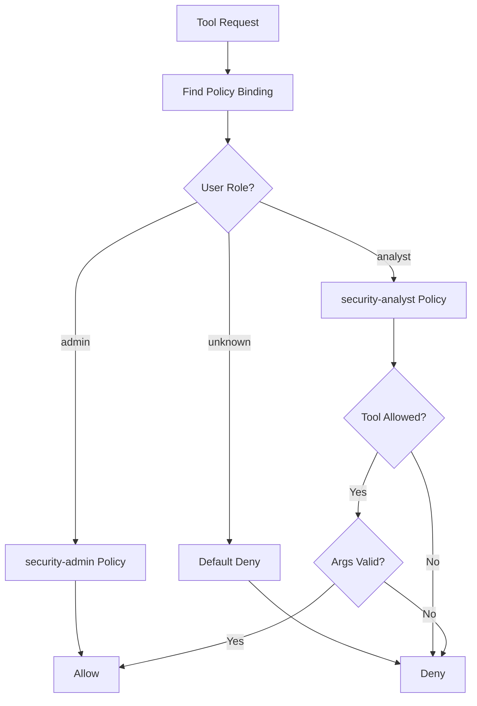

The policy engine implementation (`pkg/policy/policy.go`):

```go
func (e *Engine) Evaluate(ctx context.Context, user *domain.User, tool string, args map[string]interface{}) error {
    // Find applicable policy for user's role
    policy := e.findPolicy(user.Roles)
    if policy == nil {
        return ErrNoPolicy
    }

    // Check tool against allow/deny lists
    if !e.toolAllowed(policy, tool) {
        return fmt.Errorf("tool %q not allowed by policy %q", tool, policy.Name)
    }

    // Validate arguments against policy constraints
    for argName, argValue := range args {
        if err := e.validateArgument(policy, argName, argValue); err != nil {
            return fmt.Errorf("argument %q: %w", argName, err)
        }
    }

    return nil
}

func (e *Engine) toolAllowed(policy *Policy, tool string) bool {
    // Check deny list first (deny takes precedence)
    for _, pattern := range policy.Tools.Deny {
        if matchGlob(pattern, tool) {
            return false
        }
    }

    // Check allow list
    for _, pattern := range policy.Tools.Allow {
        if matchGlob(pattern, tool) {
            return true
        }
    }

    return false // Default deny
}
```

### 3. Input Validation

The validator middleware prevents injection attacks and enforces parameter constraints:

```go
var (
    cvePattern   = regexp.MustCompile(`^CVE-\d{4}-\d{4,}$`)
    qidPattern   = regexp.MustCompile(`^\d+$`)
    sha256Pattern = regexp.MustCompile(`^[a-fA-F0-9]{64}$`)

    // Injection patterns to block
    sqlInjection = regexp.MustCompile(`(?i)(\b(union|select|insert|update|delete|drop|create|alter|exec|execute)\b.*\b(from|into|table|database)\b)`)
    xssPatterns  = regexp.MustCompile(`(?i)(<script|javascript:|on\w+\s*=)`)
)

func (v *Validator) validateToolArgs(tool string, args map[string]interface{}) error {
    for key, value := range args {
        strVal, ok := value.(string)
        if !ok {
            continue
        }

        // Check for injection patterns
        if sqlInjection.MatchString(strVal) {
            return fmt.Errorf("potential SQL injection in %q", key)
        }
        if xssPatterns.MatchString(strVal) {
            return fmt.Errorf("potential XSS in %q", key)
        }

        // Format-specific validation
        switch key {
        case "cve", "cve_id":
            if !cvePattern.MatchString(strVal) {
                return fmt.Errorf("invalid CVE format: %q", strVal)
            }
        case "qid":
            if !qidPattern.MatchString(strVal) {
                return fmt.Errorf("invalid QID format: %q", strVal)
            }
        case "image_id", "sha256":
            if !sha256Pattern.MatchString(strVal) {
                return fmt.Errorf("invalid SHA256 format: %q", strVal)
            }
        }
    }
    return nil
}
```

### 4. Rate Limiting

Per-user rate limiting using a sliding window algorithm:

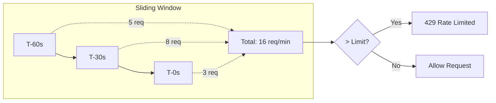

```go
type RateLimiter struct {
    mu       sync.RWMutex
    windows  map[string]*slidingWindow
    limit    int
    interval time.Duration
}

type slidingWindow struct {
    counts    []int
    timestamps []time.Time
}

func (r *RateLimiter) Allow(userID string) bool {
    r.mu.Lock()
    defer r.mu.Unlock()

    window, exists := r.windows[userID]
    if !exists {
        window = &slidingWindow{}
        r.windows[userID] = window
    }

    now := time.Now()
    cutoff := now.Add(-r.interval)

    // Remove expired entries
    valid := 0
    for i, ts := range window.timestamps {
        if ts.After(cutoff) {
            window.timestamps[valid] = window.timestamps[i]
            window.counts[valid] = window.counts[i]
            valid++
        }
    }
    window.timestamps = window.timestamps[:valid]
    window.counts = window.counts[:valid]

    // Sum requests in window
    total := 0
    for _, c := range window.counts {
        total += c
    }

    if total >= r.limit {
        return false
    }

    // Record this request
    window.timestamps = append(window.timestamps, now)
    window.counts = append(window.counts, 1)
    return true
}
```

### 5. Audit Logging

Every tool invocation is logged with sensitive data redaction:

```go
type AuditEntry struct {
    Timestamp  time.Time              `json:"timestamp"`
    RequestID  string                 `json:"request_id"`
    UserID     string                 `json:"user_id,omitempty"`
    Username   string                 `json:"username,omitempty"`
    Tool       string                 `json:"tool"`
    Arguments  map[string]interface{} `json:"arguments,omitempty"`
    Success    bool                   `json:"success"`
    Error      string                 `json:"error,omitempty"`
    DurationMs int64                  `json:"duration_ms"`
}

func sanitizeArgsForAudit(args map[string]interface{}) map[string]interface{} {
    sensitiveKeys := map[string]bool{
        "password": true, "token": true, "secret": true,
        "key": true, "api_key": true, "apikey": true,
        "credentials": true, "auth": true,
    }

    sanitized := make(map[string]interface{})
    for k, v := range args {
        if sensitiveKeys[k] {
            sanitized[k] = "[REDACTED]"
        } else {
            sanitized[k] = v
        }
    }
    return sanitized
}
```

Example audit log output:

```json
{"timestamp":"2026-02-01T10:30:45Z","request_id":"req-abc123","user_id":"user-456","username":"analyst@corp.com","tool":"search_host_detections","arguments":{"qql":"severity:5","limit":100},"success":true,"duration_ms":342}
{"timestamp":"2026-02-01T10:30:52Z","request_id":"req-def789","user_id":"user-456","username":"analyst@corp.com","tool":"get_vulnerability_details","arguments":{"qid":"12345"},"success":true,"duration_ms":128}
```

## Middleware Chain

All security controls are composed using a middleware pattern:

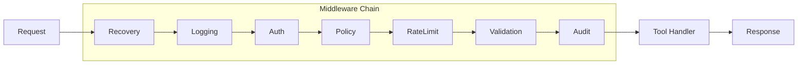

```go
type Middleware func(ToolHandler) ToolHandler
type ToolHandler func(ctx context.Context, req *ToolRequest) (*ToolResponse, error)

type Chain struct {
    middlewares []Middleware
}

func (c *Chain) Use(m Middleware) *Chain {
    c.middlewares = append(c.middlewares, m)
    return c
}

func (c *Chain) Then(handler ToolHandler) ToolHandler {
    // Wrap handler with middleware in reverse order
    wrapped := handler
    for i := len(c.middlewares) - 1; i >= 0; i-- {
        wrapped = c.middlewares[i](wrapped)
    }
    return wrapped
}

// Usage
chain := middleware.NewChain().
    Use(middleware.Recovery(logger)).
    Use(middleware.Logging(logger)).
    Use(rateLimiter.Middleware()).
    Use(validator.Middleware()).
    Use(auditLogger.Middleware())

handler := chain.Then(mcpServer.HandleToolCall)
```

## Security Hardening

### Static Analysis with gosec

We run gosec to catch common Go security issues:

```bash
$ gosec ./...
```

Issues identified and fixed:

| Issue | Description | Fix |
|-------|-------------|-----|
| G114 | HTTP server without timeouts | Added Read/Write/Idle timeouts |
| G304 | File path from variable | Added path traversal validation |
| G104 | Unhandled errors | Added explicit error handling |

**G114 Fix** - HTTP Server Timeouts:

```go
// Before (vulnerable)
http.ListenAndServe(":8080", handler)

// After (hardened)
server := &http.Server{
    Addr:              ":8080",
    Handler:           handler,
    ReadTimeout:       30 * time.Second,
    ReadHeaderTimeout: 10 * time.Second,
    WriteTimeout:      30 * time.Second,
    IdleTimeout:       120 * time.Second,
    MaxHeaderBytes:    1 << 20, // 1MB
}
server.ListenAndServe()
```

**G304 Fix** - Path Traversal Prevention:

```go
// Before (vulnerable)
data, err := os.ReadFile(userProvidedPath)

// After (hardened)
func validatePath(path string) error {
    cleanPath := filepath.Clean(path)
    if strings.Contains(cleanPath, "..") {
        return fmt.Errorf("path traversal detected")
    }
    return nil
}

if err := validatePath(userProvidedPath); err != nil {
    return err
}
data, err := os.ReadFile(filepath.Clean(userProvidedPath))
```

### Vulnerability Scanning

**govulncheck** - Checks against Go vulnerability database:

```bash
$ govulncheck ./...
No vulnerabilities found.
```

**trivy** - Scans dependencies for CVEs:

```bash
$ trivy fs --scanners vuln .
┌────────┬───────┬─────────────────┐
│ Target │ Type  │ Vulnerabilities │
├────────┼───────┼─────────────────┤
│ go.mod │ gomod │        0        │
└────────┴───────┴─────────────────┘
```

### Dependency Security

Minimal dependencies reduce attack surface:

```
github.com/mark3labs/mcp-go v0.17.0    # MCP protocol implementation
github.com/zalando/go-keyring v0.2.6   # Secure credential storage
```

Both dependencies are from reputable sources with active maintenance.

## Credential Management

Credentials are never stored in config files. The credential chain tries multiple secure sources:

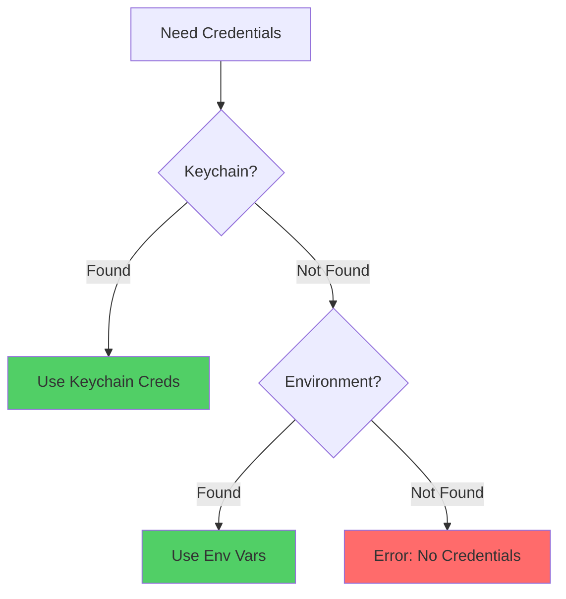

```go
type CredentialChain struct {
    providers []CredentialProvider
}

func (c *CredentialChain) Get(service string) (username, password string, err error) {
    for _, provider := range c.providers {
        username, password, err = provider.Get(service)
        if err == nil {
            return username, password, nil
        }
    }
    return "", "", fmt.Errorf("no credentials found for %s", service)
}

// Default chain: Keychain -> Environment
chain := NewCredentialChain(
    NewKeychainProvider(),
    NewEnvProvider(),
)
```

## Deployment Modes

### Mode 1: Direct stdio (Development)

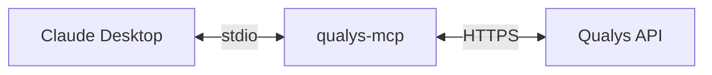

```json
{
  "mcpServers": {
    "qualys": {
      "command": "/path/to/qualys-mcp",
      "env": {
        "QUALYS_POD": "US1"
      }
    }
  }
}
```

### Mode 2: Gateway + stdio (Production)

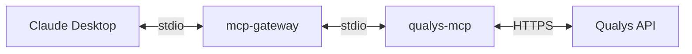

```bash
mcp-gateway \
  --jwt-issuer "https://auth.corp.com" \
  --jwt-audience "qualys-mcp" \
  --policy-file policies.yaml \
  --rate-limit 100 \
  --audit-log /var/log/mcp-audit.json \
  -- ./qualys-mcp
```

### Mode 3: HTTP Gateway (Enterprise)

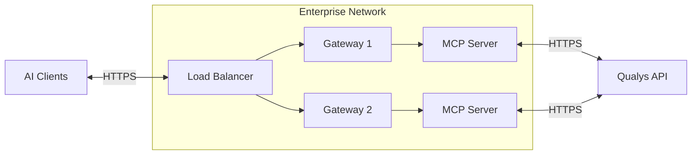

## OWASP Top 10 Coverage

| Risk | Mitigation |
|------|------------|
| A01 Broken Access Control | Policy engine with role bindings, default deny |
| A02 Cryptographic Failures | TLS for all external connections, JWT RS256 |
| A03 Injection | Input validation, QQL sanitization, regex patterns |
| A04 Insecure Design | Secure defaults, defense in depth, middleware chain |
| A05 Security Misconfiguration | Hardened HTTP server, minimal dependencies |
| A06 Vulnerable Components | govulncheck + trivy in CI/CD |
| A07 Auth Failures | JWT validation, JWKS key rotation support |
| A08 Data Integrity | Request validation, audit logging |
| A09 Logging Failures | Structured JSON audit logs, sensitive data redaction |
| A10 SSRF | No user-controlled URLs, fixed Qualys endpoints |

## Conclusion

Building a production MCP server requires the same security rigor as any API service. The key takeaways:

1. **Defense in depth**: Multiple layers of security controls
2. **Policy-based authorization**: Fine-grained control over what AI can do
3. **Audit everything**: Comprehensive logging for compliance and forensics
4. **Validate inputs**: Never trust data from any source
5. **Minimize dependencies**: Smaller attack surface
6. **Automate security scanning**: Catch issues before deployment

The complete source code demonstrates these patterns in a real-world implementation connecting AI assistants to enterprise security APIs.

---

*Built with Go 1.23 | 54 tools across 11 modules | Zero known vulnerabilities*
